# LearnNest - ICSE Class 6 Study Companion

LearnNest is a personal web application designed to help Class 6 ICSE students generate practice question papers, manage their syllabus, and organize school documents.

## Architecture Overview

```mermaid
graph TB
    subgraph "Frontend - React SPA"
        UI[User Interface<br/>React + TypeScript]
        Router[React Router<br/>Navigation]
        Components[Components<br/>- PracticeQuestions<br/>- Syllabus<br/>- Documents<br/>- Home]
        HTTP[HTTP Client<br/>Axios]
    end
    
    subgraph "Backend - Node.js/Express"
        API[Express Server<br/>Port 3000]
        Routes[API Routes<br/>- /api/papers<br/>- /api/subjects<br/>- /api/documents<br/>- /api/flashcards]
        Controllers[Controllers<br/>- questionController<br/>- subjectController<br/>- documentController]
        Services[Services<br/>- pdfService<br/>- googleDriveService]
    end
    
    subgraph "Data Layer"
        DB[(SQLite Database<br/>learnnest.sqlite)]
        Scripts[Database Scripts<br/>- regenerateAllSubjects.ts<br/>- regenerateHistory.ts<br/>- seedFlashcards.ts]
        Uploads[File Storage<br/>Document Uploads]
    end
    
    UI --> Router
    Router --> Components
    Components --> HTTP
    HTTP -->|REST API| API
    API --> Routes
    Routes --> Controllers
    Controllers --> DB
    Controllers -->|Store Files| Uploads
    Controllers -->|Generate PDFs| Services
    Scripts -->|Populate| DB
    
    style UI fill:#61dafb
    style API fill:#68a063
    style DB fill:#003b57
    style Scripts fill:#9333ea
```



## Features

- **Pre-Generated Practice Papers**: Access library of 219+ practice papers with 3 unique variants (Set A, B, C) per chapter across all ICSE Class 6 subjects
- **Detailed Answer Keys**: Comprehensive answers with step-by-step explanations for Math and detailed paragraphs for Theory subjects
- **Syllabus Manager**: Track chapters and syllabus details for all ICSE Class 6 subjects
- **Flashcard Notes**: Revision notes for quick chapter review
- **Document Vault**: Store and organize homework, circulars, and exam notices with file uploads
- **PDF Export & Print**: Generate printable PDFs of question papers with/without answers
- **Student-Friendly UI**: Clean, distraction-free interface with subject filtering and hierarchical paper selection
- **Local & Private**: Runs locally on your computer - no cloud storage, no data tracking

## Tech Stack

### Frontend
- **React 18** - UI library for building interactive components
- **TypeScript** - Type-safe JavaScript for better code quality
- **Tailwind CSS** - Utility-first CSS framework for styling
- **Vite** - Fast build tool and dev server
- **React Router DOM** - Client-side routing
- **Axios** - HTTP client for API requests
- **Lucide React** - Icon library for UI elements

### Backend
- **Node.js** - JavaScript runtime
- **Express** - Web framework for REST API
- **TypeScript** - Type-safe server code
- **SQLite3** - Lightweight embedded database with pre-seeded content
- **ts-node-dev** - Development server with auto-reload

### File Handling
- **Multer** - Middleware for file uploads
- **pdf-parse** - PDF text extraction for document processing
- **pdfkit** - PDF generation for question paper exports
- **googleapis** - Google Drive integration for document sync

## Prerequisites

- Node.js (v16 or higher)
- (Optional) Ollama installed for local AI generation

## Installation & Setup

1.  **Clone/Open the project**
    Navigate to the project folder:
    ```bash
    cd LearnNest
    ```

2.  **Setup Backend**
    ```bash
    cd server
    npm install
    ```
    
    **Configure Environment (Optional):**
    Create a `.env` file in the `server` directory:
    ```env
    PORT=3000
    ```

    **Database Setup:**
    The database comes pre-seeded with 219+ question papers. If needed, you can regenerate content:
    ```bash
    # Regenerate all subject papers with unique variants
    npx ts-node src/scripts/regenerateAllSubjects.ts
    
    # Regenerate History papers specifically
    npx ts-node src/scripts/regenerateHistory.ts
    ```

3.  **Setup Frontend**
    ```bash
    cd ..
    npm install
    ```

## Running the Application

You need to run both the server and the frontend.

1.  **Start Backend** (Terminal 1)
    ```bash
    cd server
    npm run dev
    ```

2.  **Start Frontend** (Terminal 2)
    ```bash
    # From the root directory
    npm run dev
    ```

3.  Open your browser at `http://localhost:5173`

## How AI Works

The application uses Large Language Models (LLMs) to generate questions.
- **Prompt Engineering**: We construct a detailed prompt including the subject, selected chapters, syllabus context, and difficulty level.
- **Context**: The syllabus text you enter for each chapter is sent to the AI to ensure questions are relevant.
- **Output**: The AI returns a structured JSON format which the app renders into a printable paper.
- **Storage**: Generated papers are automatically saved to the database for future reference.

## Database Structure

The SQLite database (`learnnest.sqlite`) contains:
- **subjects** - List of Class 6 ICSE subjects
- **chapters** - Chapter details with syllabus content for each subject
- **question_papers** - Generated and pre-seeded practice papers with variant tracking
- **documents** - Uploaded school documents (circulars, homework, notices)
- **flashcards** - Question-answer pairs for quick revision

## Project Structure

```
LearnNest/
├── frontend/                 # React frontend application
│   ├── src/
│   │   ├── components/      # Reusable UI components
│   │   ├── pages/           # Page components (Home, QuestionGenerator, etc.)
│   │   ├── services/        # API service layer
│   │   ├── App.tsx          # Main app component
│   │   └── main.tsx         # Entry point
│   ├── package.json
│   └── vite.config.ts
│
├── server/                   # Node.js backend server
│   ├── src/
│   │   ├── config/          # Configuration files
│   │   ├── controllers/     # Request handlers
│   │   ├── db/              # Database initialization
│   │   ├── routes/          # API route definitions
│   │   ├── services/        # Business logic (PDF, Google Drive)
│   │   ├── scripts/         # Database seeding & regeneration scripts
│   │   └── index.ts         # Server entry point
│   ├── uploads/             # Uploaded document storage
│   ├── learnnest.sqlite     # SQLite database file (pre-seeded)
│   └── package.json
│
├── start.bat / start-app.ps1  # Launch scripts for both frontend & backend
├── stop.bat / stop-app.ps1    # Stop scripts
└── README.md

```

## Script Usage

The server includes several utility scripts for managing question papers:

```bash
# Regenerate all subject papers with unique variants (Sets A, B, C)
npx ts-node src/scripts/regenerateAllSubjects.ts

# Regenerate History papers specifically
npx ts-node src/scripts/regenerateHistory.ts

# Check for duplicate questions across variants
npx ts-node src/scripts/checkAllVariants.ts

# Validate Math questions for context relevance and auto-fix (requires AI service)
npm run validate:math

# Seed flashcards for all chapters
npm run generate:flashcards
```

**Note**: All question papers are pre-generated and stored in the SQLite database. The app does not generate questions at runtime - it browses and displays pre-seeded content.

### AI-Powered Validation Script

The `validate:math` script uses AI to ensure question quality:
- ✅ Validates each question's relevance to its chapter context
- 🔍 Flags questions that don't match chapter syllabus
- 🔄 Automatically regenerates invalid questions (up to 3 attempts per question)
- ✨ Re-validates regenerated questions to ensure quality
- 📊 Provides detailed reports of all changes

**Setup Ollama (Free, Local AI - No API Key Required):**

1. **Install Ollama**
   - Download from: https://ollama.ai/download
   - Install for Windows/Mac/Linux
   
2. **Pull a model** (one-time setup)
   Choose one of these models:
   ```bash
   # Option 1: Llama 3.2 (Recommended - Fast and accurate)
   ollama pull llama3.2
   
   # Option 2: Phi 3 (Smaller, faster, good for older computers)
   ollama pull phi3
   
   # Option 3: Gemma 2 (Google's model, very capable)
   ollama pull gemma2
   
   # Option 4: Qwen 2.5 (Alibaba's model, excellent reasoning)
   ollama pull qwen2.5
   ```
   
3. **Verify it's running**
   ```bash
   ollama list
   ```

4. **(Optional) Configure in `.env`**
   ```env
   AI_MODEL=llama3.2
   OLLAMA_BASE_URL=http://localhost:11434
   ```

That's it! Ollama is completely free, runs locally, and requires no API keys or internet after initial model download.

## Future Feature Ideas

Planned enhancements:
1. **Progress Tracking** - Visual graphs showing performance over time
2. **Enhanced Flashcards** - More comprehensive revision notes with diagrams
3. **Gamification** - Badges and streaks for completing practice papers
4. **Voice Mode** - Oral quiz mode with speech-to-text
5. **Mistake Log** - Track and review incorrect answers
6. **Custom Timer** - Adjustable exam timers with practice mode
7. **Parent Dashboard** - Activity overview for parents
8. **Mobile App** - Native Android/iOS apps for on-the-go practice

## Adding Subjects/Classes

The app is currently seeded with Class 6 ICSE subjects. Add more subjects or chapters through the "Syllabus" page in the application.

## Contributing

This is a personal project, but suggestions and improvements are welcome!

## License

MIT License - Free to use and modify for personal/educational purposes.

