# LearnNest - ICSE Class 6 Study Companion

LearnNest is a personal web application designed to help Class 6 ICSE students generate practice question papers, manage their syllabus, and organize school documents.

## Architecture Overview

```mermaid
graph TB
    subgraph "Frontend - React SPA"
        UI[User Interface<br/>React + TypeScript]
        Router[React Router<br/>Navigation]
        Components[Components<br/>- QuestionGenerator<br/>- Syllabus<br/>- Documents<br/>- Home]
        HTTP[HTTP Client<br/>Axios]
    end
    
    subgraph "Backend - Node.js/Express"
        API[Express Server<br/>Port 3000]
        Routes[API Routes<br/>- /api/questions<br/>- /api/subjects<br/>- /api/documents]
        Controllers[Controllers<br/>- questionController<br/>- subjectController<br/>- documentController]
        Services[Services<br/>- aiService]
    end
    
    subgraph "AI Integration"
        HF[HuggingFace API<br/>Mistral-7B]
        Ollama[Ollama Local<br/>Mistral/LLaMA]
    end
    
    subgraph "Data Layer"
        DB[(SQLite Database<br/>learnnest.sqlite)]
        Scripts[Database Scripts<br/>- Seed Annual Papers<br/>- Seed Variants<br/>- Generate Papers]
        Uploads[File Storage<br/>Document Uploads]
    end
    
    UI --> Router
    Router --> Components
    Components --> HTTP
    HTTP -->|REST API| API
    API --> Routes
    Routes --> Controllers
    Controllers --> Services
    Controllers --> DB
    Services -->|Generate Questions| HF
    Services -->|Generate Questions| Ollama
    Scripts -->|Populate| DB
    Controllers -->|Store Files| Uploads
    
    style UI fill:#61dafb
    style API fill:#68a063
    style DB fill:#003b57
    style HF fill:#ff9d00
    style Ollama fill:#ff6b6b
```



## Features

- **AI Question Generator**: Create custom question papers (MCQs, Short/Long Answer) based on specific chapters and difficulty levels
- **Pre-Generated Papers**: Access library of practice papers with 3 unique variants (Set A, B, C) per chapter across all subjects
- **Detailed Answer Keys**: Comprehensive answers with step-by-step explanations for Math and detailed paragraphs for Theory subjects
- **Syllabus Manager**: Track chapters and syllabus details for all ICSE Class 6 subjects
- **Document Vault**: Store and organize homework, circulars, and exam notices with file uploads
- **Student-Friendly UI**: Clean, distraction-free interface with subject filtering and hierarchical paper selection
- **Local & Private**: Runs locally on your computer - no cloud storage, no data tracking

## Tech Stack

### Frontend
- **React 18** - UI library for building interactive components
- **TypeScript** - Type-safe JavaScript for better code quality
- **Tailwind CSS** - Utility-first CSS framework for styling
- **Vite** - Fast build tool and dev server
- **React Router DOM** - Client-side routing
- **Axios** - HTTP client for API requests
- **Lucide React** - Icon library for UI elements

### Backend
- **Node.js** - JavaScript runtime
- **Express** - Web framework for REST API
- **TypeScript** - Type-safe server code
- **SQLite3** - Lightweight embedded database
- **ts-node-dev** - Development server with auto-reload

### AI Integration
- **HuggingFace Inference API** - Cloud-based LLM access (Mistral-7B-Instruct)
- **Ollama** - Local LLM runtime (supports Mistral, LLaMA, etc.)

### File Handling
- **Multer** - Middleware for file uploads
- **pdf-parse** - PDF text extraction for document processing

## Prerequisites

- Node.js (v16 or higher)
- (Optional) Ollama installed for local AI generation

## Installation & Setup

1.  **Clone/Open the project**
    Navigate to the project folder:
    ```bash
    cd LearnNest
    ```

2.  **Setup Backend**
    ```bash
    cd server
    npm install
    ```
    
    **Configure AI:**
    Create a `.env` file in the `server` directory:
    ```env
    PORT=3000
    # Options: 'huggingface' or 'ollama'
    AI_PROVIDER=huggingface 
    
    # If using HuggingFace (Get free token from https://huggingface.co/settings/tokens)
    HF_API_KEY=your_huggingface_api_key
    AI_MODEL=mistralai/Mistral-7B-Instruct-v0.2

    # If using Ollama (Local)
    # AI_PROVIDER=ollama
    # OLLAMA_BASE_URL=http://localhost:11434
    # AI_MODEL=mistral
    ```

    **Seed Database (Optional but Recommended):**
    Populate the database with pre-defined annual and chapter-wise papers:
    ```bash
    # Seeds annual papers
    npm run seed:annual
    
    # Seeds detailed chapter-wise questions for all subjects
    npx ts-node src/scripts/seedNewSyllabusQuestions.ts
    ```

3.  **Setup Frontend**
    ```bash
    cd ..
    npm install
    ```

## Running the Application

You need to run both the server and the frontend.

1.  **Start Backend** (Terminal 1)
    ```bash
    cd server
    npm run dev
    ```

2.  **Start Frontend** (Terminal 2)
    ```bash
    # From the root directory
    npm run dev
    ```

3.  Open your browser at `http://localhost:5173`

## How AI Works

The application uses Large Language Models (LLMs) to generate questions.
- **Prompt Engineering**: We construct a detailed prompt including the subject, selected chapters, syllabus context, and difficulty level.
- **Context**: The syllabus text you enter for each chapter is sent to the AI to ensure questions are relevant.
- **Output**: The AI returns a structured JSON format which the app renders into a printable paper.
- **Storage**: Generated papers are automatically saved to the database for future reference.

## Database Structure

The SQLite database (`learnnest.sqlite`) contains:
- **subjects** - List of Class 6 ICSE subjects
- **chapters** - Chapter details with syllabus content for each subject
- **question_papers** - Generated and pre-seeded practice papers with variant tracking
- **documents** - Uploaded school documents (circulars, homework, notices)
- **flashcards** - Question-answer pairs for quick revision

## Project Structure

```
LearnNest/
├── frontend/                 # React frontend application
│   ├── src/
│   │   ├── components/      # Reusable UI components
│   │   ├── pages/           # Page components (Home, QuestionGenerator, etc.)
│   │   ├── services/        # API service layer
│   │   ├── App.tsx          # Main app component
│   │   └── main.tsx         # Entry point
│   ├── package.json
│   └── vite.config.ts
│
├── server/                   # Node.js backend server
│   ├── src/
│   │   ├── config/          # Configuration files
│   │   ├── controllers/     # Request handlers
│   │   ├── db/              # Database initialization
│   │   ├── routes/          # API route definitions
│   │   ├── services/        # Business logic (AI service)
│   │   ├── scripts/         # Database seeding & generation scripts
│   │   └── index.ts         # Server entry point
│   ├── uploads/             # Uploaded document storage
│   ├── learnnest.sqlite     # SQLite database file
│   └── package.json
│
├── start.bat / start-app.ps1  # Launch scripts for both frontend & backend
├── stop.bat / stop-app.ps1    # Stop scripts
└── README.md

```

## Script Usage

The server includes several utility scripts for managing question papers:

```bash
# Seed pre-generated annual examination papers
npm run seed:annual

# Generate variant papers (Sets A, B, C) for all chapters
npx ts-node src/scripts/regenerateAllSubjects.ts

# Check for duplicate questions across variants
npx ts-node src/scripts/checkAllVariants.ts

# Generate flashcards for all chapters
npm run generate:flashcards
```

## Future Feature Ideas

Planned enhancements:
1. **Progress Tracking** - Visual graphs showing performance over time
2. **Flashcards** - Auto-generated flashcards for quick revision
3. **Gamification** - Badges and streaks for completing practice papers
4. **PDF Export** - Native PDF export with professional formatting
5. **Voice Mode** - Oral quiz mode with speech-to-text
6. **Mistake Log** - Track and review incorrect answers
7. **Custom Timer** - Adjustable exam timers
8. **Parent Dashboard** - Activity overview for parents

## Adding Subjects/Classes

The app is currently seeded with Class 6 ICSE subjects. Add more subjects or chapters through the "Syllabus" page in the application.

## Contributing

This is a personal project, but suggestions and improvements are welcome!

## License

MIT License - Free to use and modify for personal/educational purposes.

